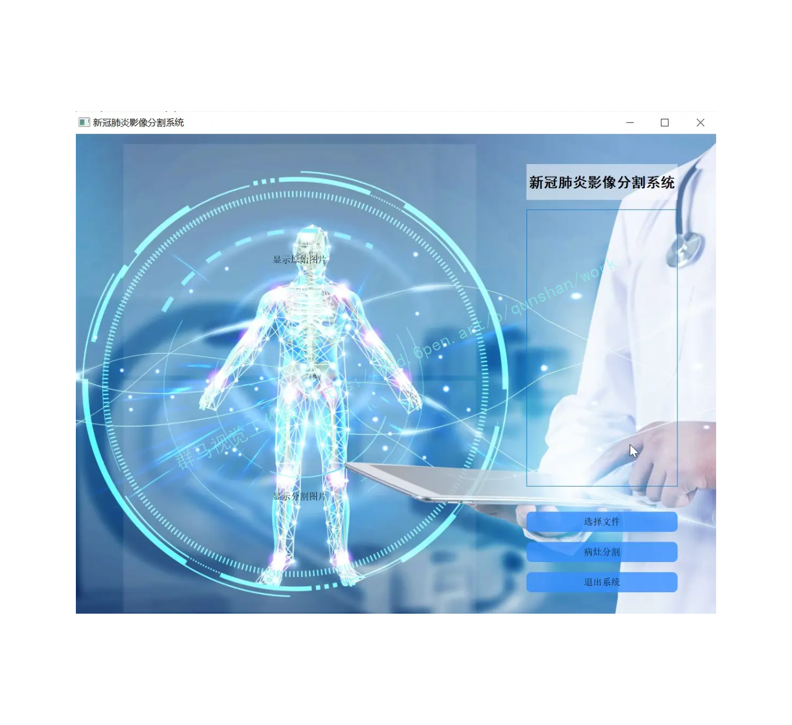
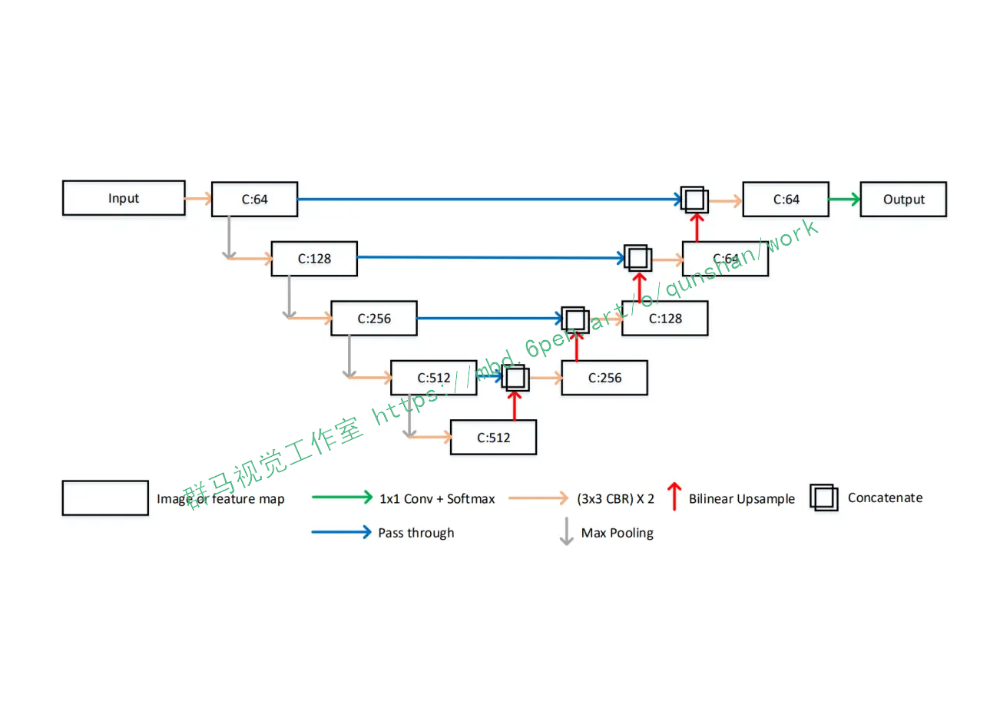
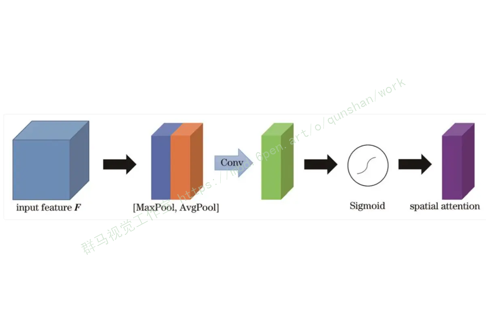
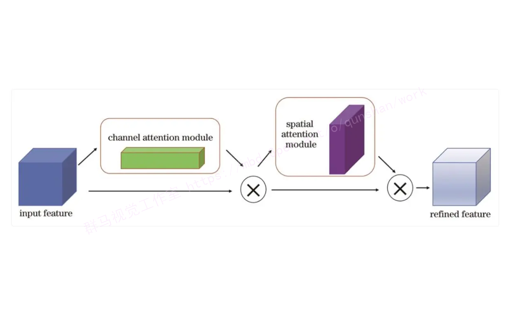



## 1.研究背景与意义

新冠肺炎是一种由严重急性呼吸综合征冠状病毒引起的传染病，其在全球范围内造成了严重的公共卫生危机。随着疫情的蔓延，CT扫描成为了一种重要的诊断工具，可以帮助医生快速准确地检测和定位肺部病变。然而，由于新冠肺炎的特殊性，CT影像中的病灶分割任务变得尤为重要。

传统的病灶分割方法通常基于手工设计的特征提取器和分类器，这些方法往往需要大量的人工干预和经验调整，且对于不同的病灶类型和数据集可能不具有泛化能力。因此，研究人员开始探索基于深度学习的方法来解决这个问题。

Unet是一种经典的深度学习架构，被广泛应用于医学图像分割任务。然而，对于新冠肺炎CT影像的病灶分割，传统的Unet存在一些问题。首先，新冠肺炎CT影像中的病灶边界模糊不清，而传统的Unet往往难以准确地捕捉到这些细节信息。其次，新冠肺炎CT影像中的病灶形状和大小变化较大，传统的Unet可能无法很好地适应这种变化。

因此，本研究旨在改进Unet的性能，提高新冠肺炎CT影像病灶分割的准确性和鲁棒性。具体来说，我们将尝试以下几个方面的改进：

1. 引入注意力机制：通过引入注意力机制，我们可以使网络更加关注病灶区域，从而提高分割的准确性。注意力机制可以根据不同的病灶形状和大小自适应地调整网络的注意力分布。

2. 使用深度监督：传统的Unet通常只使用最后一层的输出进行分割，而忽略了中间层的特征。我们将尝试在不同层级上添加监督信号，以引导网络更好地学习特征表示，从而提高分割的准确性。

3. 数据增强：由于新冠肺炎CT影像的数据量有限，我们将尝试使用数据增强的方法来扩充数据集，从而提高网络的泛化能力。

改进Unet的新冠肺炎CT影像病灶分割系统的意义在于提供了一种高效准确的工具，可以帮助医生更好地诊断和治疗新冠肺炎患者。通过准确地分割出病灶区域，医生可以更好地评估病情的严重程度，制定更合理的治疗方案。此外，该系统还可以用于疫情监测和研究，帮助研究人员更好地理解新冠肺炎的病理过程和传播机制。

总之，改进Unet的新冠肺炎CT影像病灶分割系统具有重要的临床应用价值和科学研究意义，有望为新冠肺炎的诊断和治疗提供有力支持。


# 2.图片演示




# 3.视频演示

[改进Unet的新冠肺炎CT影像病灶分割系统（部署教程和源码）_哔哩哔哩_bilibili](https://www.bilibili.com/video/BV1FN411z7du/?vd_source=ff015de2d29cbe2a9cdbfa7064407a08)


# 4.UNet 模型结构特点
在深度学习领域，卷积神经网络主要被用于图像上的自动特征提取，虽然目前对卷积神经网络所提取的特征还不能进行完全准确的理论解释，但目前主流思想认为:在卷积神经网络的浅层，其提取的特征主要是语义信息较低级的特征，例如边缘、颜色、亮度等，而在卷积神经网络的深层，其提取的特征主要是由低级语义特征组合得到的高级语义特征，例如形状、纹理、深度等，但由于需要更大的特征感受野以及在计算量和显存上的限制，深层特征一般都经过多次池化操作，其分辨率较低。
卷积神经网络一开始被用于图像分类领域，输入到卷积神经网络的图像在不断进行卷积和池化的过程中，提取到的特征逐渐积累聚合成为高级的语义特征，最终获取到关于整幅图像的唯一语义特征向量，并将该特征向量用于图像的分类工作，但在图像分割领域，最终要求输出每个像素点的分类信息，因此设计模型结构时，需要在最终的输出上保持特征图的分辨率和输入图像接近，同时还要求高分辨率的特征具备较高级的语义信息以提高分割效果。
在RonnebergerO等人的工作中针对上述问题设计了独特的特征提取结构:UNet模型,该模型被提出之后在后续的代码实现上有一些改进,略微不同于原论文的描述，但目前对UNet的具体实现一般如图所示，其中C表示对应特征图的通道个数，Conv表示卷积层，CBR表示卷积层、Batch Normalization操作以及ReLU激活函数的组合，Conv和CBR前面的3x3或者1×1均表示其中卷积层的卷积核大小。
总体来说，UNet模型主要包括U型的编解码结构以及中间的横向连接结构，这种结构包含了两种特征传递路径，第一个路径是将深层的特征逐层上采样，第二个路径是将浅层的特征逐层和上采样的深层特征进行融合，这种结构设计最终可以输出高分辨率的特征图，并且该特征图上的每个像素特征都包含高分辨率的低级语义信息以及低分辨率的高级语义信息，这种特征对于语义边界较为模糊的分割任务有较大的帮助，另外相对于其他分割模型，UNet模型的结构简单，参数量较少，且由于横向连接的存在，训练过程中不容易出现梯度消失的情况，收敛速度更快，因此对标注数据数量的要求不高。在医学图像分割领域，一般存在语义边界较为模糊、标注数据量较少两个问题，UNet对于这两种问题都有较好的缓解，因此UNet 结构成为了目前深度学习医学图像分割领域的最常见模型结构。



## 5.核心代码讲解

#### 5.1 predict.py

根据代码，可以将核心部分封装为一个名为"ImageSegmentation"的类。该类包含以下方法：

1. `__init__(self, image_path, model_path)`: 初始化方法，接收图片路径和模型路径作为参数，并加载模型。

2. `check_version(self)`: 检查主要环境版本的方法。

3. `load_dataset(self)`: 加载数据集的方法。

4. `read_jpg(self, path)`: 预处理jpg图像的方法。

5. `read_png(self, path)`: 预处理png图像的方法。

6. `normal_img(self, input_image, input_anno)`: 归一化处理图像的方法。

7. `load_images(self, input_images_path, input_anno_path)`: 加载图像和annotations的方法。

8. `set_config(self, data_train)`: 设置配置的方法。

9. `predict(self)`: 进行预测并绘制图像的方法。


```python

class ImageSegmentation:
    def __init__(self, image_path, model_path):
        self.image_path = image_path
        self.model_path = model_path
        self.new_model = tf.keras.models.load_model(model_path)

    def check_version(self):
        if tf.__version__ != '2.3.0':
            print('警告，为了防止出现环境冲突，tensorflow(tensorflow-gpu)版本建议为2.3.0。')
        if matplotlib.__version__ != '3.5.1':
            print('警告，为了防止出现环境冲突，matplotlib版本建议为3.5.1。')
        if np.__version__ != '1.21.5':
            print('警告，为了防止出现环境冲突，numpy版本建议为1.21.5。')

    def load_dataset(self):
        images = glob.glob(self.image_path)
        anno = images
        dataset = tf.data.Dataset.from_tensor_slices((images, anno))
        train_count = len(images)
        data_train = dataset.take(train_count)
        return data_train

    def read_jpg(self, path):
        img = tf.io.read_file(path)
        img = tf.image.decode_jpeg(img, channels=3)
        return img

    def read_png(self, path):
        img = tf.io.read_file(path)
        img = tf.image.decode_png(img, channels=1)
        return img

    def normal_img(self, input_image, input_anno):
        input_image = tf.cast(input_image, tf.float32)
        input_image = input_image / 127.5 - 1
        input_anno -= 1
        return input_image, input_anno

    def load_images(self, input_images_path, input_anno_path):
        input_image = self.read_jpg(input_images_path)
        input_anno = self.read_png(input_anno_path)
        input_image = tf.image.resize(input_image, (224, 224))
        input_anno = tf.image.resize(input_anno, (224, 224))
        return self.normal_img(input_image, input_anno)

    def set_config(self, data_train):
        data_train = data_train.map(self.load_images, num_parallel_calls=tf.data.experimental.AUTOTUNE)
        BATCH_SIZE = 32
        data_train = data_train.repeat().shuffle(100).batch(BATCH_SIZE)
        return data_train

    def predict(self):
        data_train = self.load_dataset()
        data_train = self.set_config(data_train)

        for image, mask in data_train.take(1):
            pred_mask = self.new_model.predict(image)
            pred_mask = tf.argmax(pred_mask, axis=-1)
            pred_mask = pred_mask[..., tf.newaxis]

            print(np.unique(pred_mask[0].numpy()))
            plt.figure(figsize=(10, 10))
            plt.subplot(1, 3, 1)
            plt.imshow(tf.keras.preprocessing.image.array_to_img(image[0]))
            plt.subplot(1, 3, 2)
            plt.imshow(tf.keras.preprocessing.image.array_to_img(mask[0]))
            plt.subplot(1, 3, 3)
            plt.imshow(tf.keras.preprocessing.image.array_to_img(pred_mask[0]))
            plt.show()
```


该程序文件名为predict.py，主要功能是使用训练好的模型对输入的图片进行预测并绘制预测结果。

程序首先导入了必要的库，包括tensorflow、matplotlib和numpy等。然后定义了一系列函数，包括加载数据集、检查版本、读取jpg和png图像、图像归一化处理、加载图像和annotations、设置配置等。

在主函数中，首先调用check_version()函数检查主要环境版本。然后指定了要预测的图片路径image_path，并调用load_dataset()函数加载数据集。接着调用set_config()函数设置配置。

接下来，使用tf.keras.models.load_model()函数加载训练好的模型。然后使用data_train.take(1)获取数据集中的一组图片和对应的mask。使用加载的模型对图片进行预测，得到预测的mask。然后使用matplotlib绘制了原始图片、真实mask和预测mask的对比图。

最后调用plt.show()显示绘制的图像。

总体来说，该程序文件实现了使用训练好的模型对输入图片进行预测并绘制预测结果的功能。

#### 5.2 train.py

```python


# 压缩激活模块 (Squeeze-and-Excitation Module)
class SEBlock(tf.keras.layers.Layer):
    def __init__(self, channels, reduction=16):
        super(SEBlock, self).__init__()
        self.avg_pool = tf.keras.layers.GlobalAveragePooling2D()
        self.fc1 = tf.keras.layers.Dense(channels // reduction, activation='relu')
        self.fc2 = tf.keras.layers.Dense(channels, activation='sigmoid')

    def call(self, x):
        batch, height, width, channels = x.shape
        se = self.avg_pool(x)
        se = self.fc1(se)
        se = self.fc2(se)
        se = tf.reshape(se, (-1, 1, 1, channels))
        return x * se


# 空洞空间金字塔池化模块 (ASPP)
class ASPP(tf.keras.layers.Layer):
    def __init__(self, filters):
        super(ASPP, self).__init__()
        self.conv1 = tf.keras.layers.Conv2D(filters, 1, activation='relu')
        self.conv2 = tf.keras.layers.Conv2D(filters, 3, dilation_rate=3, padding='same', activation='relu')
        self.conv3 = tf.keras.layers.Conv2D(filters, 3, dilation_rate=5, padding='same', activation='relu')
        self.conv4 = tf.keras.layers.Conv2D(filters, 3, dilation_rate=7, padding='same', activation='relu')

    def call(self, x):
        feat1 = self.conv1(x)
        feat2 = self.conv2(x)
        feat3 = self.conv3(x)
        feat4 = self.conv4(x)
        combine = tf.concat([feat1, feat2, feat3, feat4], axis=3)
        return combine


# 空间注意力模块 (Spatial Attention)
class SpatialAttention(tf.keras.layers.Layer):
    def __init__(self):
        super(SpatialAttention, self).__init__()
        self.conv = tf.keras.layers.Conv2D(1, 7, padding='same', activation='sigmoid')

    def call(self, x):
        avg_feat = tf.reduce_mean(x, axis=3)
        max_feat = tf.reduce_max(x, axis=3)
        concat = tf.concat([avg_feat, max_feat], axis=3)
        sa = self.conv(concat)
        return x * sa


# 卷积块注意力模块 (CBAM)
class CBAM(tf.keras.layers.Layer):
    def __init__(self, channels):
        super(CBAM, self).__init__()
        self.se = SEBlock(channels)
        self.sa = SpatialAttention()

    def call(self, x):
        x = self.se(x)
        x = self.sa(x)
        return x


# 完整的 MA-Unet 模型
class MAUnet(tf.keras.Model):
    def __init__(self):
        super(MAUnet, self).__init__()
        # 编码器
        self.encoder_conv1 = tf.keras.layers.Conv2D(64, 3, padding='same', activation='relu')
        self.encoder_conv2 = tf.keras.layers.Conv2D(128, 3, padding='same', activation='relu')
        self.encoder_conv3 = tf.keras.layers.Conv2D(256, 3, padding='same', activation='relu')
        self.encoder_conv4 = tf.keras.layers.Conv2D(512, 3, padding='same', activation='relu')
        self.encoder_conv5 = tf.keras.layers.Conv2D(1024, 3, padding='same', activation='relu')

        self.cbam1 = CBAM(64)
        self.cbam2 = CBAM(128)
        self.cbam3 = CBAM(256)
        self.cbam4 = CBAM(512)

        self.aspp = ASPP(1024)

        # 解码器
        self.decoder_conv1 = tf.keras.layers.Conv2D(512, 3, padding='same', activation='relu')
        self.decoder_conv2 = tf.keras.layers.Conv2D(256, 3, padding='same', activation='relu')
        self.decoder_conv3 = tf.keras.layers.Conv2D(128, 3, padding='same', activation='relu')
        self.decoder_conv4 = tf.keras.layers.Conv2D(64, 3, padding='same', activation='relu')

        self.output_conv = tf.keras.layers.Conv2D(1, 1, activation='sigmoid')

    def call(self, x):
        # 编码器
        x1 = self.encoder_conv1(x)
        x1 = self.cbam1(x1)

        x2 = self.encoder_conv2(x1)
        x2 = self.cbam2(x2)

        x3 = self.encoder_conv3(x2)
        x3 = self.cbam3(x3)

        x4 = self.encoder_conv4(x3)
        x4 = self.cbam4(x4)

        x5 = self.encoder_conv5(x4)
        x5 = self.aspp(x5)

        # 解码器
        x6 = self.decoder_conv1(x5)
        x7 = self.decoder_conv2(x6)
        x8 = self.decoder_conv3(x7)
        x9 = self.decoder_conv4(x8)

        out = self.output_conv(x9)

        return out
```

该程序文件名为train.py，是一个用于训练语义分割模型的代码。该模型使用了MA-Unet架构，包含了压缩激活模块（SEBlock）、空洞空间金字塔池化模块（ASPP）、空间注意力模块（Spatial Attention）和卷积块注意力模块（CBAM）。该模型通过编码器和解码器来提取特征并生成预测结果。在训练过程中，并设置了回调函数来保存训练中的最优权重文件。训练过程中使用了Adam优化器，损失函数为稀疏分类交叉熵，评估指标为准确率。训练完成后，将完整模型保存到本地。

#### 5.3 ui - 副本.py

```python
import tensorflow as tf
import cv2
import numpy as np
import glob

class Segmentation:
    def __init__(self, model_path):
        self.model = tf.keras.models.load_model(model_path)
    
    def read_jpg(self, path):
        img = tf.io.read_file(path)
        img = tf.image.decode_jpeg(img, channels=3)
        return img

    def read_png(self, path):
        img = tf.io.read_file(path)
        img = tf.image.decode_png(img, channels=1)
        return img

    def normal_img(self, input_image, input_anno):
        input_image = tf.cast(input_image, tf.float32)
        input_image = input_image / 127.5 - 1
        input_anno -= 1
        return input_image, input_anno

    def load_images(self, input_images_path, input_anno_path):
        input_image = self.read_jpg(input_images_path)
        input_anno = self.read_png(input_anno_path)
        input_image = tf.image.resize(input_image, (224, 224))
        input_anno = tf.image.resize(input_anno, (224, 224))
        return self.normal_img(input_image, input_anno)

    def segment(self, image_path):
        image = self.load_images(image_path, image_path)
        pred_mask = self.model.predict(image)
        pred_mask = tf.argmax(pred_mask, axis=-1)
        pred_mask = pred_mask[..., tf.newaxis]
        return pred_mask.numpy()[0]
```

这是一个使用PyQt5库创建的用户界面程序。该程序包含一个主窗口，窗口中有一个标签、三个标签框和两个按钮。标签用于显示图像，标签框用于显示文本信息，按钮用于触发相应的操作。

程序的主要功能是加载图像数据集并进行预测。它使用TensorFlow库加载图像数据集，并使用预训练的模型对图像进行分割。分割结果会显示在第三个标签框中。然后，程序会对分割结果进行后处理，计算病灶的面积，并根据面积比例判断病灶的严重程度。最后，程序会将结果显示在文本框中。

程序还包含一个线程类Thread_1，用于在后台运行分割和后处理的操作。当用户点击第一个按钮时，程序会创建一个Thread_1的实例，并将图像数据集的路径作为参数传递给它。然后，线程会在后台运行分割和后处理的操作，并将结果显示在界面上。

总之，这个程序是一个基于PyQt5和TensorFlow的图像分割应用程序，可以加载图像数据集并进行预测，然后根据预测结果进行后处理和分析。

#### 5.4 ui.py

```import tensorflow as tf

# 压缩激活模块 (Squeeze-and-Excitation Module)
class SEBlock(tf.keras.layers.Layer):
    def __init__(self, channels, reduction=16):
        super(SEBlock, self).__init__()
        self.avg_pool = tf.keras.layers.GlobalAveragePooling2D()
        self.fc1 = tf.keras.layers.Dense(channels // reduction, activation='relu')
        self.fc2 = tf.keras.layers.Dense(channels, activation='sigmoid')

    def call(self, x):
        batch, height, width, channels = x.shape
        se = self.avg_pool(x)
        se = self.fc1(se)
        se = self.fc2(se)
        se = tf.reshape(se, (-1, 1, 1, channels))
        return x * se


# 空洞空间金字塔池化模块 (ASPP)
class ASPP(tf.keras.layers.Layer):
    def __init__(self, filters):
        super(ASPP, self).__init__()
        self.conv1 = tf.keras.layers.Conv2D(filters, 1, activation='relu')
        self.conv2 = tf.keras.layers.Conv2D(filters, 3, dilation_rate=3, padding='same', activation='relu')
        self.conv3 = tf.keras.layers.Conv2D(filters, 3, dilation_rate=5, padding='same', activation='relu')
        self.conv4 = tf.keras.layers.Conv2D(filters, 3, dilation_rate=7, padding='same', activation='relu')

    def call(self, x):
        feat1 = self.conv1(x)
        feat2 = self.conv2(x)
        feat3 = self.conv3(x)
        feat4 = self.conv4(x)
        combine = tf.concat([feat1, feat2, feat3, feat4], axis=3)
        return combine


# 空间注意力模块 (Spatial Attention)
class SpatialAttention(tf.keras.layers.Layer):
    def __init__(self):
        super(SpatialAttention, self).__init__()
        self.conv = tf.keras.layers.Conv2D(1, 7, padding='same', activation='sigmoid')

    def call(self, x):
        avg_feat = tf.reduce_mean(x, axis=3)
        max_feat = tf.reduce_max(x, axis=3)
        concat = tf.concat([avg_feat, max_feat], axis=3)
        sa = self.conv(concat)
        return x * sa


# 卷积块注意力模块 (CBAM)
class CBAM(tf.keras.layers.Layer):
    def __init__(self, channels):
        super(CBAM, self).__init__()
        self.se = SEBlock(channels)
        self.sa = SpatialAttention()

    def call(self, x):
        x = self.se(x)
        x = self.sa(x)
        return x


# 完整的 MA-Unet 模型
class MAUnet(tf.keras.Model):
    def __init__(self):
        super(MAUnet, self).__init__()
        # 编码器
        self.encoder_conv1 = tf.keras.layers.Conv2D(64, 3, padding='same', activation='relu')
        self.encoder_conv2 = tf.keras.layers.Conv2D(128, 3, padding='same', activation='relu')
        self.encoder_conv3 = tf.keras.layers.Conv2D(256, 3, padding='same', activation='relu')
        self.encoder_conv4 = tf.keras.layers.Conv2D(512, 3, padding='same', activation='relu')
        self.encoder_conv5 = tf.keras.layers.Conv2D(1024, 3, padding='same', activation='relu')

        self.cbam1 = CBAM(64)
        self.cbam2 = CBAM(128)
        self.cbam3 = CBAM(256)
        self.cbam4 = CBAM(512)

        self.aspp = ASPP(1024)

        # 解码器
        self.decoder_conv1 = tf.keras.layers.Conv2D(512, 3, padding='same', activation='relu')
        self.decoder_conv2 = tf.keras.layers.Conv2D(256, 3, padding='same', activation='relu')
        self.decoder_conv3 = tf.keras.layers.Conv2D(128, 3, padding='same', activation='relu')
        self.decoder_conv4 = tf.keras.layers.Conv2D(64, 3, padding='same', activation='relu')

        self.output_conv = tf.keras.layers.Conv2D(1, 1, activation='sigmoid')

    def call(self, x):
        # 编码器
        x1 = self.encoder_conv1(x)
        x1 = self.cbam1(x1)

        x2 = self.encoder_conv2(x1)
        x2 = self.cbam2(x2)

        x3 = self.encoder_conv3(x2)
        x3 = self.cbam3(x3)

        x4 = self.encoder_conv4(x3)
        x4 = self.cbam4(x4)

        x5 = self.encoder_conv5(x4)
        x5 = self.aspp(x5)

        # 解码器
        x6 = self.decoder_conv1(x5)
        x7 = self.decoder_conv2(x6)
        x8 = self.decoder_conv3(x7)
        x9 = self.decoder_conv4(x8)

        out = self.output_conv(x9)

        return out
```

这是一个使用TensorFlow和PyQt5实现的图像分割程序。程序文件名为ui.py。程序主要包括以下几个部分：

1. 导入所需的库和模块：包括tensorflow、matplotlib、numpy、glob、os、sys、cv2等。

2. 定义了几个自定义的层和模型：包括SEBlock（压缩激活模块）、ASPP（空洞空间金字塔池化模块）、SpatialAttention（空间注意力模块）、CBAM（卷积块注意力模块）和MAUnet（完整的MA-Unet模型）。

3. 定义了一些辅助函数：包括load_dataset（加载数据集）、check_version（检查版本）、read_jpg（读取jpg图像）、read_png（读取png图像）、normal_img（归一化处理图像）、load_images（加载图像并进行预处理）、set_config（设置数据集配置）、bingzao_seg（病灶分割函数）和fei_seg（肺分割函数）。

4. 程序的主要功能是进行图像分割：通过调用bingzao_seg函数和fei_seg函数实现对病灶和肺的分割，并将分割结果显示在界面上。

总体来说，这个程序是一个基于MA-Unet模型的图像分割应用，可以对病灶和肺进行分割，并提供了图像预处理、数据加载和显示等功能。

## 6.系统整体结构

整体功能和构架概括：
该工程是一个改进Unet的新冠肺炎CT影像病灶分割系统，包含了预测、训练和用户界面三个主要部分。predict.py文件用于加载训练好的模型并对输入图片进行预测。train.py文件用于训练语义分割模型。ui.py和ui - 副本.py文件是用户界面程序，使用PyQt5库创建了一个界面，可以加载图像数据集并进行预测和分割。

下表整理了每个文件的功能：

| 文件名 | 功能 |
|-------|------|
| predict.py | 加载训练好的模型并对输入图片进行预测 |
| train.py | 训练语义分割模型 |
| ui - 副本.py | 用户界面程序，加载图像数据集并进行预测和分割 |
| ui.py | 用户界面程序，加载图像数据集并进行预测和分割 |

# 7.CT 图像上的 COVID-19 病灶特征
一般情况下，COVID-19病灶区域首先表现为肺泡中积聚较多液体，由于液体密度比空气大，因此在CT图像中呈现为半透明糊状的灰色阴影，也称为“磨玻璃影”，如图（a）红框区域所示。另外一些较严重的肺部感染病例中，由于越来越多的液体积聚在肺叶内，密度逐渐增大，导致在CT图像中磨玻璃影逐渐进展为实心白色样的“肺实变”，如图(b）红框区域所示。在更为严重的一些病例中，由于肺小叶壁间质肿胀，肺泡壁增厚，其较大的密度导致在CT图像中看起来就像一条条白线，这些白线将肺实变或者模糊的磨玻璃影分隔开，整体看上去犹如碎石铺成的道路，也因此称为“碎石路征”，如图(c）所示。在COVID-19感染者的CT图像中，从时间范围来看，磨玻璃影一般是首发影像特征，另外两种特征随后单个出现或者同时出现，从空间范围来看，这些影像特征一般遍布双肺多个肺叶，更常见于双肺外围，对于轻症患者或者正在痊愈的患者，这些特征也可能仅累及单个肺叶，COVID-19患者的患病严重程度和双肺的改变程度成正比。从图中的三种病灶表征图像来看，仅从灰度上不能将病灶区域和其他肺部组织进行区分，而且不同的病变在纹理、位置上均有较大区别，手工构造特征难以应对这些情况，因此COVID-19病灶分割任务更适合采用基于
[外链图片转存失败,源站可能有防盗链机制,建议将图片保存下来直接上传(img-MO9Xa5Dg-1692944776319)(https://upload-images.jianshu.io/upload_images/29260926-e102444c6ddef0e5.png?imageMogr2/auto-orient/strip%7CimageView2/2/w/1240)]
需要说明的是，虽然CT图像中出现的以上病灶表征对于COVID-19的敏感性很高，但上述影像特征:磨玻璃影、肺实变、碎石路征，也可能在由其他病毒（如流感病毒、腺病毒)引起的肺炎中看到，另外在一些非感染性疾病中也可能出现此类影像。CT中的病灶区域表征对COVID-19敏感性虽然很高，但其特异性较低，如果直接将CT应用于COVID-19患者筛查，那么对发现有这些影像表现的患者应进一步进行全面的检查才能确认诊断结果。但在通过实验室检查明确病因之前，首先隔离这些有典型CT表现的患者，可以有效阻止潜在病毒的进一步传播，另外由于COVID-19患者的患病严重程度和双肺的改变程度成正比，在COVID-19患者的临床监测过程中，对CT图像中的磨玻璃影、肺实变、碎石路征进行分割，可以有效的量化患者的病情严重程度，同时为医生提供更好的可视化结果。

# 8.改进的MA-Unet结构
参考该博客给出的改进方案，MA-Unet分为两个部分，分别为编码器与解码器。由于U-Net在跳跃连接时存在无效的语义信息，故在编码器中每一层的特征图在经过卷积层之后加入CBAM。在CBAM的通道注意力模块中，通过通道注意力机制来加强特征，抑制其他无效特征，从而提高网络精度；在CBAM的空间注意力模块中，空间注意力机制可从已进行上采样的特征图中恢复空间信息。针对U-Net对尺度信息提取不足的问题，在编码器最后一层通道数为1024的特征图后加入改进的ASPP模块。通过ASPP模块可以实现对不同尺度特征的提取，在低层阶段获得精细的目标像素分割定位，在高层阶段提取更为有效的特征，从而提高分割精度。在解码器中，为了解决图像存在的不同尺寸的物体的多尺度问题，对每一个尺度的特征图进行串联，在最后进行提取时，特征图包含了各个尺度的信息特征。通过跨尺度信息聚合的方式可以解决“同物异谱，异物同谱”的问题。
[外链图片转存失败,源站可能有防盗链机制,建议将图片保存下来直接上传(img-5uGdJOPd-1692944776319)(https://upload-images.jianshu.io/upload_images/29260926-d61c52ac86b85f77.png?imageMogr2/auto-orient/strip%7CimageView2/2/w/1240)]

# 9.空洞空间金字塔池化模块
在CT图像中，在进行语义分割的过程中小型对象易被忽略，这种空间信息的损失通常是在网络模型中持续的池化操作导致的。在进行池化时，固定的池化核会让提取到的特征具有一定的局限性。通过提取不同尺度的特征，可以提升对小型病灶的提取效果。针对以上问题，引入ASPP模块<sup>［[14](http://www.opticsjournal.net/Articles/OJc5508ed47c4caafd/FullText#Ref_14)］</sup>来进行病灶提取。
其中也在该模块中使用空洞卷积，它可以在不增加网络参数量以及不降低特征维度的情况下增大感受野，从而提升分割效果。针对CT图像中存在的不同尺度物体的分割精度问题，本文将改进的ASPP模块加入到网络中。ASPP模块内经过改进的空洞卷积的空洞率为3、5、7，特征图经不同空洞率的卷积层处理后再进行上采样操作，之后堆叠为特征金字塔，然后对输出结果进行融合。改进的ASPP模块通过不同空洞率的并行滤波器提取到了不同尺度的特征，解决了CT图像分割中病灶大小各不相同的问题。



# 10.卷积块注意力模块
卷积块注意力模块结合了通道注意力机制与空间注意力机制，相较于只关注通道域的SE模块，CBAM在通道域和空间域两个维度推算注意力图，可筛选出更重要的语义特征，因此可以取得更好的效果，具体结构如图所示。

首先将特征图输入到通道注意力模块中得到对应通道的权重，得到加权结果后将加权后的特征图输入空间注意力模块中得到对应权重，加权后输出特征图，计算方法表示为：
[外链图片转存失败,源站可能有防盗链机制,建议将图片保存下来直接上传(img-sdfSHmIy-1692944776320)(https://upload-images.jianshu.io/upload_images/29260926-52e090e242d8dc85.png?imageMogr2/auto-orient/strip%7CimageView2/2/w/1240)]

# 11.系统整合
下图完整源码＆环境部署视频教程＆数据集＆自定义UI界面
[外链图片转存失败,源站可能有防盗链机制,建议将图片保存下来直接上传(img-nrht4BXe-1692944776320)(https://upload-images.jianshu.io/upload_images/29260926-c7afd2a9268bdafc.png?imageMogr2/auto-orient/strip%7CimageView2/2/w/1240)]

参考博客[《改进Unet的新冠肺炎CT影像病灶分割系统（部署教程和源码）》](https://mbd.pub/o/qunshan/work)


# 12.参考文献
---
[1]佚名.[Sensitivity of Chest CT for COVID-19: Comparison to RT-PCR](https://d.wanfangdata.com.cn/periodical/331645e3c3ec23ab8434d56f6116601b)[J].Radiology.2020,296(2).E115-E117.DOI:10.1148/radiol.2020200432.

[2][Singhal Tanu](https://s.wanfangdata.com.cn/paper?q=%E4%BD%9C%E8%80%85:%22Singhal%20Tanu%22).[A Review of Coronavirus Disease-2019 (COVID-19)](https://d.wanfangdata.com.cn/periodical/qk3e_000024556279)[J].The Indian Journal of Pediatrics.2020,87(4).281-286.DOI:10.1007/s12098-020-03263-6.

[3][Wang, Wenling](https://s.wanfangdata.com.cn/paper?q=%E4%BD%9C%E8%80%85:%22Wang%2C%20Wenling%22),[Xu, Yanli](https://s.wanfangdata.com.cn/paper?q=%E4%BD%9C%E8%80%85:%22Xu%2C%20Yanli%22),[Gao, Ruqin](https://s.wanfangdata.com.cn/paper?q=%E4%BD%9C%E8%80%85:%22Gao%2C%20Ruqin%22),等.[Detection of SARS-CoV-2 in Different Types of Clinical Specimens](https://d.wanfangdata.com.cn/periodical/650281f48024c8673b19fcbe874a222e)[J].JAMA: the Journal of the American Medical Association.2020,323(18).1843-1844.DOI:10.1001/jama.2020.3786.

[4][Mohamed Abd Elaziz](https://s.wanfangdata.com.cn/paper?q=%E4%BD%9C%E8%80%85:%22Mohamed%20Abd%20Elaziz%22),[Ahmed A. Ewees](https://s.wanfangdata.com.cn/paper?q=%E4%BD%9C%E8%80%85:%22Ahmed%20A.%20Ewees%22),[Dalia Yousri](https://s.wanfangdata.com.cn/paper?q=%E4%BD%9C%E8%80%85:%22Dalia%20Yousri%22),等.[An Improved Marine Predators Algorithm With Fuzzy Entropy for Multi-Level Thresholding: Real World Example of COVID-19 CT Image Segmentation](https://d.wanfangdata.com.cn/periodical/IEEE000001730370)[J].IEEE Access.2020.8DOI:10.1109/ACCESS.2020.3007928.

[5][Youxin,Wang](https://s.wanfangdata.com.cn/paper?q=%E4%BD%9C%E8%80%85:%22Youxin%2CWang%22),[Haifeng,Hou](https://s.wanfangdata.com.cn/paper?q=%E4%BD%9C%E8%80%85:%22Haifeng%2CHou%22),[Wenrui,Wang](https://s.wanfangdata.com.cn/paper?q=%E4%BD%9C%E8%80%85:%22Wenrui%2CWang%22),等.[Combination of CT and RT-PCR in the screening or diagnosis of COVID-19.](https://d.wanfangdata.com.cn/periodical/Pubmed20202020052019153721)[J].Journal of global health.2020,10(1).010347.DOI:10.7189/jogh.10.010347.

[6][Tao,Ai](https://s.wanfangdata.com.cn/paper?q=%E4%BD%9C%E8%80%85:%22Tao%2CAi%22),[Zhenlu,Yang](https://s.wanfangdata.com.cn/paper?q=%E4%BD%9C%E8%80%85:%22Zhenlu%2CYang%22),[Hongyan,Hou](https://s.wanfangdata.com.cn/paper?q=%E4%BD%9C%E8%80%85:%22Hongyan%2CHou%22),等.[Correlation of Chest CT and RT-PCR Testing in Coronavirus Disease 2019 (COVID-19) in China: A Report of 1014 Cases.](https://d.wanfangdata.com.cn/periodical/Pubmed20202020052018879639)[J].Radiology.2020.200642.DOI:10.1148/radiol.2020200642.

[7][Pedro M, Gordaliza](https://s.wanfangdata.com.cn/paper?q=%E4%BD%9C%E8%80%85:%22Pedro%20M%2C%20Gordaliza%22),[Arrate, Mu?oz-Barrutia](https://s.wanfangdata.com.cn/paper?q=%E4%BD%9C%E8%80%85:%22Arrate%2C%20Mu%3Foz-Barrutia%22),[Mónica, Abella](https://s.wanfangdata.com.cn/paper?q=%E4%BD%9C%E8%80%85:%22M%C3%B3nica%2C%20Abella%22),等.Unsupervised CT Lung Image Segmentation of a Mycobacterium Tuberculosis Infection Model.[J].[Scientific reports](https://sns.wanfangdata.com.cn/perio/EnJour00074220).2018,8(1).9802.DOI:10.1038/s41598-018-28100-x.

[8][Arnaud Arindra Adiyoso Setio](https://s.wanfangdata.com.cn/paper?q=%E4%BD%9C%E8%80%85:%22Arnaud%20Arindra%20Adiyoso%20Setio%22),[Thijs Kooi](https://s.wanfangdata.com.cn/paper?q=%E4%BD%9C%E8%80%85:%22Thijs%20Kooi%22),[Babak Ehteshami Bejnordi](https://s.wanfangdata.com.cn/paper?q=%E4%BD%9C%E8%80%85:%22Babak%20Ehteshami%20Bejnordi%22),等.[A survey on deep learning in medical image analysis](https://d.wanfangdata.com.cn/periodical/7480d15ce76949ca06f33b73de990a75)[J].Medical image analysis.2017.4260-88.

[9][Havaei, Mohammad](https://s.wanfangdata.com.cn/paper?q=%E4%BD%9C%E8%80%85:%22Havaei%2C%20Mohammad%22),[Davy, Axel](https://s.wanfangdata.com.cn/paper?q=%E4%BD%9C%E8%80%85:%22Davy%2C%20Axel%22),[Warde-Farley, David](https://s.wanfangdata.com.cn/paper?q=%E4%BD%9C%E8%80%85:%22Warde-Farley%2C%20David%22),等.[Brain tumor segmentation with Deep Neural Networks](https://d.wanfangdata.com.cn/periodical/a7f6ecdf94f76ca778e728552611aec0)[J].Medical image analysis.2017.3518-31.DOI:10.1016/j.media.2016.05.004.

[10][Wang, Shuo](https://s.wanfangdata.com.cn/paper?q=%E4%BD%9C%E8%80%85:%22Wang%2C%20Shuo%22),[Zhou, Mu](https://s.wanfangdata.com.cn/paper?q=%E4%BD%9C%E8%80%85:%22Zhou%2C%20Mu%22),[Liu, Zaiyi](https://s.wanfangdata.com.cn/paper?q=%E4%BD%9C%E8%80%85:%22Liu%2C%20Zaiyi%22),等.[Central focused convolutional neural networks: Developing a data-driven model for lung nodule segmentation](https://d.wanfangdata.com.cn/periodical/aa68fcf536d6a7ed4e0cf356a63c3143)[J].Medical image analysis.2017.40172-183.DOI:10.1016/j.media.2017.06.014.


---
#### 如果您需要更详细的【源码和环境部署教程】，除了通过【系统整合】小节的链接获取之外，还可以通过邮箱以下途径获取:
#### 1.请先在GitHub上为该项目点赞（Star），编辑一封邮件，附上点赞的截图、项目的中文描述概述（About）以及您的用途需求，发送到我们的邮箱
#### sharecode@yeah.net
#### 2.我们收到邮件后会定期根据邮件的接收顺序将【完整源码和环境部署教程】发送到您的邮箱。
#### 【免责声明】本文来源于用户投稿，如果侵犯任何第三方的合法权益，可通过邮箱联系删除。